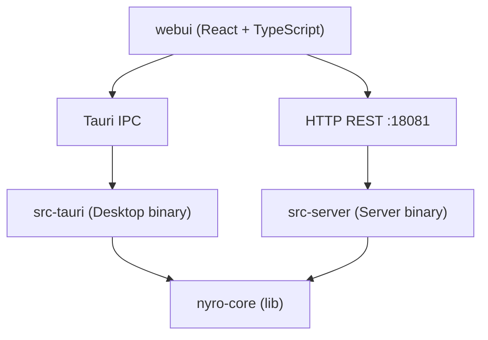

# Nyro AI Gateway — 架构设计

---

## 1. 产品定位与部署形态

Nyro 是一个**本地运行**的 AI 协议代理网关，让任意使用 OpenAI / Anthropic / Gemini SDK 的客户端工具（Claude Code、Codex CLI、Gemini CLI、OpenCode 等）无需改代码，仅修改 `base_url` 即可将请求路由到任意 LLM Provider。

```
Claude Code · Codex CLI · Gemini CLI · OpenCode
     OpenAI SDK · Anthropic SDK · Gemini SDK
              Any HTTP API Client
                      ↓
              Nyro AI Gateway
            (localhost:19530)
                      ↓
    OpenAI · Anthropic · Google · DeepSeek
    MiniMax · xAI · Zhipu · Ollama · ...
```

**两种部署形态：**

| 形态 | 实现 | 适用场景 |
|---|---|---|
| Desktop | Tauri v2 桌面应用（macOS / Windows / Linux） | 个人开发者，零部署，数据不离开本机 |
| Server | 独立 Rust 二进制，HTTP 管理 API + WebUI | 自托管、团队共享 |

核心原则：`nyro-core` 只暴露纯 Rust API（struct + async fn），**不感知传输层**。Desktop 版通过 Tauri IPC 调用，Server 版通过 HTTP REST 调用。

---

## 2. Workspace 分层

```
nyro/
├── Cargo.toml                    # workspace 定义
├── crates/
│   └── nyro-core/                # 核心库（lib crate）
│       └── src/
│           ├── proxy/            # 代理面：axum router、handler
│           ├── protocol/         # 协议转换引擎
│           │   ├── openai/       # OpenAI 协议适配（含 Responses API）
│           │   ├── anthropic/    # Anthropic 协议适配
│           │   ├── gemini/       # Gemini 协议适配
│           │   └── semantic/     # 语义规范化层
│           ├── router/           # 路由规则匹配
│           ├── storage/          # 存储层（SQLite / Postgres）
│           ├── db/               # 数据库访问
│           ├── logging/          # 日志采集
│           ├── crypto/           # API Key 加解密
│           ├── cache/            # 缓存
│           └── admin/            # 管理 API（纯 Rust 函数）
├── src-tauri/                    # Desktop 版（Tauri binary）
│   └── src/
│       ├── main.rs               # Tauri 入口
│       └── commands.rs           # Tauri IPC → nyro-core 管理 API
├── src-server/                   # Server 版（独立 binary）
│   └── src/
│       ├── main.rs               # tokio 入口，启动 axum
│       └── admin_routes.rs       # HTTP REST → nyro-core 管理 API
└── webui/                        # 前端（Desktop / Server 共用）
```

**依赖关系：**



**nyro-core 核心 API：**

```
Gateway::new(config)      → 初始化数据库、启动代理服务
Gateway::start_proxy()    → 启动 axum HTTP Server（代理面）
Gateway::admin()          → 返回 AdminService，提供全部管理操作
  ├── .list_providers()
  ├── .create_provider(input)
  ├── .test_provider(id)
  ├── .list_routes()
  ├── .query_logs(filter)
  ├── .get_stats_overview()
  └── ...
Gateway::shutdown()       → 优雅关闭
```

---

## 3. 协议转换架构

Nyro 在多协议入口（OpenAI / Anthropic / Gemini / Responses API）与多厂商出口之间做语义级转换。核心设计原则：

- **语义优先**：先还原语义，再做协议编码，避免字段级互转导致的信息丢失
- **单向分层**：`Decoder → IR → Semantic Normalize → Encoder → Upstream → Parser → Post-Process → Formatter`
- **最小耦合**：协议差异收敛在 `protocol/*`，业务编排在 `proxy/handler`

### 3.1 完整调用流程

```
+--------------------+                  +----------------------------------------+
| Client / CLI / SDK | -- HTTP/SSE --> | Nyro Proxy Entry (axum route handler)  |
+--------------------+                  +-------------------+--------------------+
                                                        |
                                                        v
                                     +------------------------------------------+
                                     | Ingress Decoder                          |
                                     | - openai / anthropic / gemini / responses|
                                     | - parse request -> InternalRequest (IR)  |
                                     +-------------------+----------------------+
                                                         |
                                                         v
                                     +------------------------------------------+
                                     | Semantic Normalize (Request Side)        |
                                     | - reasoning extraction                   |
                                     | - tool correlation / id recovery         |
                                     | - response-items pre-shape               |
                                     +-------------------+----------------------+
                                                         |
                                                         v
                                     +------------------------------------------+
                                     | Egress Encoder (Target Provider Protocol)|
                                     | - openai / anthropic / gemini            |
                                     | - sanitize schema / normalize tool ids   |
                                     +-------------------+----------------------+
                                                         |
                                                         v
                                     +------------------------------------------+
                                     | Upstream HTTP Call (reqwest)             |
                                     +-----------+------------------------------+
                                                 |
                           +---------------------+----------------------+
                           |                                            |
                           v                                            v
            +-------------------------------+            +----------------------------------+
            | Non-Stream Upstream Response  |            | Stream Upstream SSE Response     |
            +---------------+---------------+            +----------------+-----------------+
                            |                                             |
                            v                                             v
         +-------------------------------------------+   +-------------------------------------------+
         | Response Parser                           |   | Stream Parser                             |
         | -> InternalResponse                       |   | -> StreamDelta sequence                   |
         +----------------------+--------------------+   +----------------------+--------------------+
                                |                                           |
                                v                                           v
         +-------------------------------------------+   +-------------------------------------------+
         | Semantic Post-Process                     |   | Semantic Post-Process                     |
         | - reasoning / thinking normalize          |   | - reasoning delta normalize               |
         | - function_call / message item finalize   |   | - tool_call delta ordering fix            |
         +----------------------+--------------------+   +----------------------+--------------------+
                                |                                           |
                                v                                           v
         +-------------------------------------------+   +-------------------------------------------+
         | Formatter (to ingress protocol)           |   | Stream Formatter (to ingress protocol)    |
         | - finish_reason / usage align             |   | - SSE events + DONE / stop events         |
         +----------------------+--------------------+   +----------------------+--------------------+
                                |                                           |
                                +-------------------+-----------------------+
                                                    |
                                                    v
                                   +------------------------------------------+
                                   | Return to Client                         |
                                   | - JSON (non-stream) or SSE (stream)      |
                                   +------------------------------------------+

      Side Channel (async):
      +--------------------------------------------------------------+
      | usage / status / latency / tool flags -> logging & stats     |
      +--------------------------------------------------------------+
```

### 3.2 内部表示（IR）

`crates/nyro-core/src/protocol/types.rs` 定义统一的内部结构，将"协议字段"转换为"语义对象"：

- `InternalRequest`：统一的入站请求表示，含消息列表、工具定义、模型参数
- `InternalResponse`：支持推理内容（reasoning）与 item 级表达（reasoning / function_call / message）
- `StreamDelta`：流式增量事件，支持 reasoning delta 与 text / tool_call 并行

---

## 4. 语义规范化层

目录：`crates/nyro-core/src/protocol/semantic/`

| 模块 | 职责 |
|---|---|
| `reasoning.rs` | 统一提取 reasoning（结构化字段优先，`<think>` 兜底），确保客户端不看到原始标签泄漏 |
| `tool_correlation.rs` | 统一 tool_call_id 关联与恢复（含 hint、重排、孤儿 tool_call 处理） |
| `response_items.rs` | 统一构建 Responses item（reasoning / function_call / message） |

**Tool Call 关联策略：**

```
1. 优先按 tool_call_id 精确匹配
2. 其次按工具名与上下文 hint 兜底
3. 处理重复 ID、孤儿 tool_call、非相邻 tool_result 场景
4. 无法恢复时返回明确错误，不放行潜在错误请求
```

**流式与非流式一致性约束：**

- 存在 `tool_calls` 时，`finish_reason` 必须为 `tool_calls`
- usage 信息映射到统一字段，别名键统一归一
- 空白文本块不触发无意义输出
- 结束事件必须完整，避免 CLI 提前中断或挂起

---

## 5. 协议适配层

目录：`crates/nyro-core/src/protocol/{openai,anthropic,gemini}/`

每个协议模块的职责边界：

| 子模块 | 职责 |
|---|---|
| `decoder` | 协议输入 → IR（InternalRequest） |
| `encoder` | IR → 上游协议请求 |
| `parser` / `stream` | 解析上游响应（非流式 / 流式） |
| `formatter` | IR 结果 → 入口协议格式输出 |

**厂商差异处理：**

| 厂商 | 差异点 | 处理策略 |
|---|---|---|
| Gemini | 工具参数 schema 包含不兼容字段（`$schema` 等） | encoder 阶段做安全清洗 |
| Gemini stream | functionCall 参数 JSON 可能分片 | 延迟输出，等参数完整后再下发 |
| Anthropic | tool_use_id 格式约束 | encoder 阶段规范化，确保合法 |
| DeepSeek / 其他 | `<think>` 标签混在文本流中 | stream parser 阶段提取为 reasoning delta |

**支持的入口协议与对应端口路径：**

| 入口协议 | 客户端 | 路径前缀 |
|---|---|---|
| OpenAI | OpenAI SDK、Codex CLI 等 | `/v1/chat/completions` |
| OpenAI Responses API | Codex CLI（`/v1/responses`） | `/v1/responses` |
| Anthropic | Claude Code、Anthropic SDK | `/v1/messages` |
| Gemini | Gemini CLI、Gemini SDK | `/v1beta/models/...` |

---

## 6. 路由与访问控制

### 6.1 Route 模型

路由唯一键为 `(ingress_protocol, virtual_model)`：

| 字段 | 类型 | 说明 |
|---|---|---|
| `id` | TEXT PK | UUID |
| `name` | TEXT | 人类可读名称 |
| `ingress_protocol` | TEXT | 接入协议：`openai` / `anthropic` / `gemini` |
| `virtual_model` | TEXT | 客户端传入的 model 值，精确匹配 |
| `target_provider` | TEXT FK | 目标模型提供商 |
| `target_model` | TEXT | 实际调用的模型 |
| `access_control` | BOOLEAN | 是否启用访问控制，默认 false |
| `is_active` | BOOLEAN | 路由启用状态，默认 true |

虚拟模型名继承规则：`virtual_model = 用户填写 ?? target_model`

两种使用模式：
- **透明代理**：虚拟模型名 = 真实模型名，客户端代码与直连 Provider 完全一致
- **抽象层**：虚拟模型名 ≠ 真实模型名，后端随时切换模型，客户端无感知

### 6.2 API Key 模型

Route 与 API Key 是**独立管理、多对多绑定**的关系：

```
API Key ──── (授权绑定) ──── Route
  │                            │
  ├── 配额: RPM / TPM / TPD     ├── 接入协议 (openai / anthropic / gemini)
  ├── 过期时间                  ├── 虚拟模型名 (精确匹配)
  ├── 状态: active / revoked   ├── 目标提供商 + 目标模型
  └── 名称                      └── 访问控制开关
```

Key 格式：`sk-<32位hex>`，AES-256-GCM 加密存储。

绑定语义：

| Key 绑定状态 | 行为 |
|---|---|
| 未绑定任何路由 | 默认拒绝，不可访问任何开启了访问控制的路由 |
| 绑定了特定路由 | 精准生效，仅可访问绑定列表中的路由 |

### 6.3 代理请求鉴权流程

```
1. 解析请求 → 提取 ingress_protocol, model, api_key
   (优先级: Authorization: Bearer > x-api-key)
2. match(ingress_protocol, model) → Route
   └── 未匹配 → 404 no route
3. if route.access_control == false:
   └── 直接放行
4. if api_key 为空 → 401 unauthorized
5. 验证 api_key:
   a. 不存在 → 401 invalid key
   b. status != 'active' → 403 key revoked
   c. expires_at < now → 403 key expired
   d. route 不在 key 绑定列表 → 403 forbidden
   e. 配额超限 (rpm / tpm / tpd) → 429 rate limited
6. 执行路由转发 → target_provider + target_model
```

---

## 7. 模型能力识别

### 7.1 ai:// 内部协议

Provider 配置中通过 `modelsSource` / `capabilitiesSource` 声明数据来源，支持两类值：

| 值类型 | 示例 | 说明 |
|---|---|---|
| HTTP URL | `https://api.openai.com/v1/models` | 直接向 HTTP 端点请求 |
| 内部协议 | `ai://models.dev/openai` | 从 Nyro 内嵌 / 缓存的 models.dev 数据中查询 |

协议格式：`ai://{source}/{key}`

当前支持的数据源：

| URI | 说明 |
|---|---|
| `ai://models.dev/{vendor-key}` | 内嵌 models.dev 快照，查指定厂商的模型列表和能力 |
| `ai://models.dev/` | 全局模式，聚合所有厂商，按模型名做全局匹配 |

解析逻辑（`protocol/types.rs`）：

```rust
enum ResolvedSource {
    Http(String),        // "https://..." → 直接请求
    ModelsDev(String),   // "ai://models.dev/{key}" → 查内嵌数据
    Auto,                // 空值 → 自动匹配模式
}
```

### 7.2 能力字段与用途

模型能力标签用于：
- 路由配置界面展示能力标签，辅助用户选择目标模型
- 转发请求时根据能力自动处理不兼容字段（如目标模型不支持 tools 时自动剥离）
- CLI 接入页根据模型能力动态生成正确的工具配置

Provider 预设配置存储于 `crates/nyro-core/assets/providers.json`，通过 `include_str!` 编译进二进制，前端同步加载。

---

## 8. 存储与数据层

### 8.1 双后端

| 后端 | 适用形态 | 路径 |
|---|---|---|
| SQLite | Desktop（单用户本地） | `crates/nyro-core/src/storage/sqlite/` |
| PostgreSQL | Server（多用户自托管） | `crates/nyro-core/src/storage/postgres/` |

统一接口定义在 `crates/nyro-core/src/storage/` 抽象层，上层代码不感知具体后端。

### 8.2 核心表结构

```sql
-- 提供商配置
CREATE TABLE providers (
    id           TEXT PRIMARY KEY,
    name         TEXT NOT NULL,
    protocol     TEXT NOT NULL,   -- openai / anthropic / gemini
    base_url     TEXT NOT NULL,
    api_key      TEXT NOT NULL,   -- AES-256-GCM 加密存储
    ...
);

-- 路由规则
CREATE TABLE routes (
    id                TEXT PRIMARY KEY,
    name              TEXT NOT NULL,
    ingress_protocol  TEXT NOT NULL,
    virtual_model     TEXT NOT NULL,
    target_provider   TEXT NOT NULL REFERENCES providers(id),
    target_model      TEXT NOT NULL,
    access_control    INTEGER NOT NULL DEFAULT 0,
    is_active         INTEGER NOT NULL DEFAULT 1,
    UNIQUE(ingress_protocol, virtual_model)
);

-- 访问控制 Key
CREATE TABLE api_keys (
    id         TEXT PRIMARY KEY,
    key        TEXT NOT NULL UNIQUE,  -- sk-<32位hex>
    name       TEXT NOT NULL,
    rpm        INTEGER,
    tpm        INTEGER,
    tpd        INTEGER,
    status     TEXT NOT NULL DEFAULT 'active',
    expires_at TEXT
);

-- Key 与 Route 的绑定关系
CREATE TABLE api_key_routes (
    api_key_id  TEXT NOT NULL REFERENCES api_keys(id) ON DELETE CASCADE,
    route_id    TEXT NOT NULL REFERENCES routes(id) ON DELETE CASCADE,
    PRIMARY KEY (api_key_id, route_id)
);

-- 请求日志
CREATE TABLE request_logs (
    id             TEXT PRIMARY KEY,
    route_id       TEXT,
    ingress_proto  TEXT,
    model          TEXT,
    status_code    INTEGER,
    latency_ms     INTEGER,
    input_tokens   INTEGER,
    output_tokens  INTEGER,
    created_at     TEXT
);
```

### 8.3 安全

- Provider API Key 使用 AES-256-GCM 加密存储，密钥派生自本机唯一标识
- Desktop 模式下管理 API 仅监听 `127.0.0.1`，外部不可访问
- Server 模式下管理端口与代理端口独立，可配置鉴权

---

## 9. 前端适配层

前端（`webui/`）通过薄抽象层兼容两种部署形态：

```typescript
// webui/src/lib/backend.ts

// Desktop 版：通过 Tauri IPC 调用
async function invokeIPC<T>(cmd: string, args?: object): Promise<T> {
  const { invoke } = await import('@tauri-apps/api/core');
  return invoke<T>(cmd, args);
}

// Server 版：通过 HTTP 调用
async function invokeHTTP<T>(cmd: string, args?: object): Promise<T> {
  const resp = await fetch(`/api/v1/${cmd}`, {
    method: 'POST',
    headers: { 'Content-Type': 'application/json' },
    body: JSON.stringify(args),
  });
  return resp.json();
}
```

**技术栈：**

| 层 | 技术 |
|---|---|
| 框架 | React 19 + TypeScript + Vite |
| 状态 | Zustand |
| 数据获取 | TanStack Query |
| 路由 | React Router v7 |
| 样式 | Tailwind CSS 4 |
| 图表 | Recharts |
